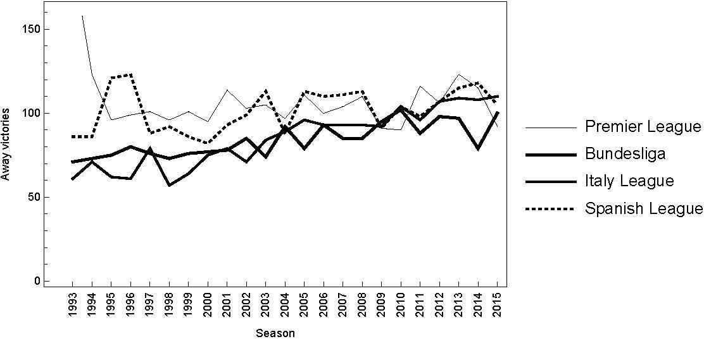

class:  inverse, center, middle

# Índice

---

## Índice

1. [Introducción](#introduccion)

2. [Objetivos](#2objetivos)

3. [Metodología](#3metodologia)

4. [Descripción de los datos](#4datos)

5. [Resultados](#5resultados)

6. Conclusiones

---

class:  inverse, center, middle
name: 1introduccion

# 1. Introducción.

---
## 1. Introducción.

* Adopción del nuevo sistema de puntuación
    * 3 puntos para el equipo que conseguía la victoria
    * 1 punto para el ambos equipos en caso de empate
    * 0 puntos el equipo derrotado

* Calendario de adopción
    * Premier League inglesa (1981)
    * Copa de Mundo y clasificación para la Eurocopa (1994)
    * La Liga española y en la Champions League (1995)

---

##  Efectos del sitema de puntuación 3-1-0 frente al sistema 2-1-0

Brocas, I.; Carrillo, J.  Do the ”three-point victory” and ”golden goal” rules make soccer more exciting? *J. Sports Econ.*
**2004**, 5, 169–185. [[CrossRef]](http://dx.doi.org/10.1177/1527002503257207)

Dilger, A.; Geyer, H. Are three points for a win really better than two? a comparison of german soccer league and cup games.
*J. Sports Econ.* **2009**,10, 305–318. [[CrossRef]](http://dx.doi.org/10.1177/1527002508327521)

Guedes, J.; Machado, F.  Changing rewards in contests: Has the three-point rule brought more offense to soccer? *Empir. Econ.*
**2002**, 27, 607–630. [[CrossRef]](http://dx.doi.org/10.1007/s001810100106)

Hon, L.; Parinduri, R.  Does the three-point rule make soccer more exciting?  evidence from a regression discontinuity design.
*J. Sports Econ.* **2016**, 17, 377–395. [[CrossRef]](http://dx.doi.org/10.1177/1527002514531790)
8.
Chen, M.; Dey, D.; Shao, Q.  A new skewed link model for dichotomo

---

.center[Away victories in four of the most important European football leagues from 1993–1994 to
2015–2016 seasons.]
---

class:  inverse, center, middle
name: 2objetivos

# 2. Objetivos.

---

## 2. Objetivos.

<ru-blockquote>Determinar los factores relevantes que afectan a las victorias fuera de casa de los equipos de fútbol</ru-blockquote>


- Modelo *Logit*

- Modelo *Bayesiano*

- Modelo *Bayesiano asimétrico*

---
class:  inverse, center, middle
name: 3metodologia

# 3. Metodología.

---

## 3. Metodología

### Modelo *Logit*

$$\mathcal{L}_t(\beta)=log\left(\frac{p_t}{1-p_t}\right)=x'_t\beta,\qquad t=1,2,\ldots,n.$$

```{r, echo = FALSE, fig.align='center', fig.height=5, fig.width=7, message = FALSE}
library(latex2exp)
logit <- function(x){
  exp(x)/(1 + exp(x))
}

x <- seq(-6,6,0.005)
y <- logit(x)
plot(x,y,col = 'blue', pch = 16, frame = FALSE, cex = 0.2)
text(-5,0.9,parse(text = TeX('$f(x)=\\frac{1}{1+e^{-x\\beta}}$')))
#expression(f(x)==frac(1,1+e^(-x * beta))))
```
---

## Modelo Bayesiano

> Con la aproximación bayesiana los parámetros $\beta$ son variables aleatorias asumiendo que siguen una distribución a priori normal no informativa.

- Especificación

$$\begin{array}{rcl}\mathcal{L}_t(\beta)&=&log\left(\frac{p_t}{1-p_t}\right)=x'_t\beta,\qquad t=1,2,\ldots,n.\\\beta&\sim&\pi(\beta)\end{array}$$
---
background-image: url("img/G2_mod.jpg")
background-position: center bottom
background-size: 50%

## Modelo Bayesiano asimétrico


.center[Home victories and draws versus away victories in four of the most important European football leagues from the 2012–2013 to 2015–2016 seasons.]

---

## Modelo Bayesiano asimétrico

$$y_t=\left\{\begin{array}{rl}1,&w_t\geq 0\\0,&w_t<0\end{array}\right.$$

$$w_t=x'\beta+\delta z_t+\varepsilon_t,\,z\sim G,\, \varepsilon\sim F$$

- $F$ es la función logística estandarizada
- $G$ distribución normal acumulada media-estandarizada
    - $g(z)=\sqrt{2/\pi}\mbox{exp}(-z^2/2),\, z>0$
    

$$\begin{array}{rcl}\mathcal{L}_t(\beta)&=&log\left(\frac{p_t}{1-p_t}\right)=x'_t\beta+\delta z_t,\qquad t=1,2,\ldots,n.\\(\beta,\delta)&\sim&\pi(\beta,\delta)\end{array}$$

---
class:  inverse, center, middle
name: 4datos

# 4. Descripción de los datos

---


```{r, message = FALSE, echo = FALSE}
library(knitr)
library(kableExtra)
library(dplyr)
tabla1 <- data.frame(
  Variable = c('HS','AS','AF','HC','AC','HY','AY','HR','AR',
               'DERBY','BUDH','BUDA','INTERNATIONAL','ACIENT'),
  `Descripción` = c('Tiros a puerta equipo local',
                  'Tiros a puerta equipo visitante',
                  'Faltas cometidas equipo local',
                  'Corners a favor del equipo local',
                  'Corners a favor del equipo visitante',
                  'Tarjetas amarillas equipo local',
                  'Tarjetas amarillas equipo visitante',
                  'Tarjetas rojas equipo local',
                  'Tarjetas rojas equipo visitante',
                  'Partido jugado entre equipos de la misma ciudad, región o frente a los equipos más fuertes de la liga',
                  'Presupuesto equipo local',
                  'Presupuesto equipo visitante',
                  'Experiencia internacional',
                  'Años ejerciendo en primera división')
)
tabla1 %>%
  kable('html') %>%
  kable_styling(bootstrap_options = c("striped", "hover", "condensed", "responsive"), font_size = 11) %>%
  pack_rows("Estadísticas de juego", 1, 9,label_row_css = "background-color: #666; color: #fff;") %>%
  pack_rows("Partido", 10, 10, label_row_css = "background-color: #666; color: #fff;") %>%
  pack_rows('No pertenecientes al juego',11,12, label_row_css = "background-color: #666; color: #fff;") %>%
  pack_rows('Árbitro',13,14, label_row_css = "background-color: #666; color: #fff;")
  
```


---
class:  inverse, center, middle
name: 5resultados

# 5. Resultados


---
```{r, message = FALSE, echo = FALSE}
tabla2 <- readr::read_csv('tabla2.csv', col_names = FALSE)


 tabla2 %>%
  setNames(c('Variables','$$\\hat{\\beta_l}$$', 'Robust Sd' , 'p-Value' , '$$\\hat{\\beta_b}$$' , 'Sd b' , 'MC Error b' , '$$\\hat{\\beta_{ba}}$$' , 'Sd ba' ,'MC Error ba')) %>%
   mutate_if(is.numeric, as.character) %>%
  
  kable('html') %>%
   kable_styling(bootstrap_options = c("striped", "hover", "condensed", "responsive"), font_size = 11) %>%
   add_header_above(c(" " = 1, "Logit" = 3, "Bayesiano" = 3, "Bayesiano Asimétrico" = 3))
   
   


   
```
---

```{r, message = FALSE, echo = FALSE}
tabla3 <- readr::read_csv('tabla3.csv', col_names = FALSE)


 tabla3 %>%
  setNames(c('Variables','$$\\hat{\\beta_l}$$', 'Robust Sd' , 'p-Value' , '$$\\hat{\\beta_b}$$' , 'Sd b' , 'MC Error b' , '$$\\hat{\\beta_{ba}}$$' , 'Sd ba' ,'MC Error ba')) %>%
   mutate_if(is.numeric, as.character) %>%
  
  kable('html') %>%
   kable_styling(bootstrap_options = c("striped", "hover", "condensed", "responsive"), font_size = 11) %>%
   add_header_above(c(" " = 1, "Logit" = 3, "Bayesiano" = 3, "Bayesiano Asimétrico" = 3))
   
   


   
```

---
class:  inverse, center, middle
name: 5conclusiones

# 5. Conclusiones.

---

- Se presenta modelo logit asimétrico que estudia cuales son los factores determinantes e una victoria fuera de casa.

- Permite al estamento directivo del equipo disponer de una herramienta que detecte los factores potenciales para las victorias fuera de casa.

- La asimetría de debe ser incluida dentro del modelo logit.

---


class:  inverse, center, middle

# Las victorias fuera de casa en fútbol:un modelo bayesiano